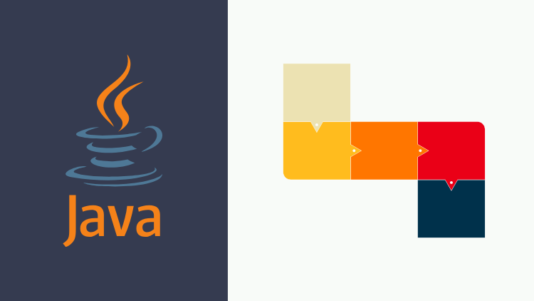

# Modern Java: Stream Gatherers, Scalable I/O & Concurrency

This repoistory contains the source code for my [**Modern Java: Stream Gatherers, Scalable I/O & Concurrency**](https://www.udemy.com/course/java-stream-gatherers/) course on Udemy.

----

**Prerequisite:** Familiarity with Java Virtual Threads is recommended. If you are new to Virtual Threads, consider checking out my companion course on the topic for a solid foundation.

**This in-depth course is designed for experienced Java developers looking to master the cutting-edge Stream Gatherers API and unlock the full potential of Virtual Threads for building high-performance, scalable applications.**

Java has evolved, and so have its concurrency tools. With the introduction of Stream Gatherers and Virtual Threads, you can now write efficient, readable, and scalable I/O pipelines using familiar Stream constructs. This course is practical, modern, and tailored to help you build real-world, concurrent Java applications without the traditional complexity of thread management.

## What You Will Learn

- Understand how Stream Gatherers enhance the Java Stream API
- Master Stateless Gatherers using integrators for simple yet powerful stream transformations
- Build Stateful Gatherers using initializers for scenarios that require shared or evolving context
- Implement Finisher logic for end-of-stream aggregation, cleanup, or final state transformation
- Explore Combiners and their role in parallel stream execution
- Deep-dive into built-in gatherers and learn when and how to use them effectively
- Write your own custom gatherers to unlock advanced stream patterns
- Use Virtual Threads to handle high-volume I/O-bound tasks with minimal overhead
- Design Concurrent Gatherers that:
    - Execute and emit results
    - Support Concurrency Limits to avoid resource exhaustion
    - Handle errors without blocking other operations (e.g. Delay Error pattern)
    - Allow Nested Concurrent Processing for multi-stage, multi-level pipelines
    - Build a Massive I/O Stream Pipeline project using Stream Gatherers + Virtual Threads
    - Ingest 150K+ API calls efficiently with lightweight concurrency
    - Avoid intermediate collection for better throughput and memory efficiency
    - Save data with batched writes and stream-friendly persistence

## Why Take This Course?

Many developers avoid writing high-concurrency code because of complexity and fear of resource management. This course changes that by using Stream Gatherers and Virtual Threads to simplify the process.

You will learn how to think in terms of composable data pipelines rather than low-level threads or futures. The examples and patterns you build will help you tackle real I/O-heavy use cases with confidence and performance.
